# Windows Server Update Services (WSUS) Kurulum Rehberi  
## Windows Server 2025 Üzerinde WSUS Kurulumu ve Yapılandırması  

Bu rehber, **Windows Server 2025 Standard Evaluation** sistemine **Windows Server Update Services (WSUS)** rolünün nasıl kurulacağını ve yapılandırılacağını adım adım açıklar. Kurulum, `Server Manager` aracılığıyla gerçekleştirilir.  

---

## 📑 İçindekiler  

- [Ön Gereksinimler ve Hazırlık](#ön-gereksinimler-ve-hazırlık)  
- [WSUS Kurulum Adımları](#-wsus-kurulum-adımları)  
  - [Adım 1: Server Manager Ana Ekranı](#adım-1-server-manager-ana-ekranı)  
  - [Adım 2: "Add Roles and Features Wizard" Başlatma](#adım-2-add-roles-and-features-wizard-başlatma)  
  - [Adım 3: Kurulum Türü Seçimi](#adım-3-kurulum-türü-seçimi)  
  - [Adım 4: Hedef Sunucu Seçimi](#adım-4-hedef-sunucu-seçimi)  
  - [Adım 5: WSUS Rolü Seçimi](#adım-5-wsus-rolü-seçimi)  
  - [Adım 6: WSUS Role Services Seçimi](#adım-6-wsus-role-services-seçimi)  
  - [Adım 7: Content Location Seçimi](#adım-7-content-location-seçimi)  
  - [Adım 8: Yükleme İşlemi ve Onay](#adım-8-yükleme-işlemi-ve-onay)  
  - [Adım 9: Post-Installation Tasks Başlatma](#adım-9-post-installation-tasks-başlatma)  
  - [Adım 10: WSUS Configuration Arayüzü](#adım-10-wsus-configuration-arayüzü)  
  - [Adım 11: Microsoft Connection ve Dil Seçimi](#adım-11-microsoft-connection-ve-dil-seçimi)  
  - [Adım 12: Update Kaynakları ve İşletim Sistemleri Seçimi](#adım-12-update-kaynakları-ve-işletim-sistemleri-seçimi)  
  - [Adım 13: Update Sınıflandırmaları ve Zamanlama](#adım-13-update-sınıflandırmaları-ve-zamanlama)  
  - [Adım 14: Update Services Arayüzü ve Ekstra Özellikler](#adım-14-update-services-arayüzü-ve-ekstra-özellikler)  
- [Kurulum Sonrası Ekstra Özellikler](#-kurulum-sonrası-ekstra-özellikler)  
- [Sık Karşılaşılan Sorunlar ve Çözümler](#-sık-karşılaşılan-sorunlar-ve-çözümler)  
- [Doküman Bilgileri](#-doküman-bilgileri)  

---

## 🔰 Ön Gereksinimler ve Hazırlık  

### Sistem Gereksinimleri  
- **İşletim Sistemi:** Windows Server 2025 Standard/Datacenter  
- **Bellek:** Minimum 4 GB (Önerilen 8+ GB)  
- **Depolama:** Minimum 100 GB boş alan (Update içeriği için)  
- **Ağ:** Statik IP adresi ve DNS yapılandırması  

### Ağ ve Güvenlik Hazırlıkları  
```powershell
# Statik IP ayarlama
New-NetIPAddress -IPAddress "192.168.31.100" -PrefixLength 24 -DefaultGateway "192.168.31.1" -InterfaceAlias "Ethernet"

# DNS sunucusu ayarlama
Set-DnsClientServerAddress -InterfaceAlias "Ethernet" -ServerAddresses "127.0.0.1"

# Sunucu ismini ayarlama
Rename-Computer -NewName "WSUS-SERVER" -Restart
```

### Kritik Ön Kontroller  
- ✅ Windows Update yamaları tamamlanmış olmalı  
- ✅ Güvenlik duvarı 8530/8531 portları (HTTP/HTTPS) açılmış olmalı  
- ✅ SQL Server veya Windows Internal Database (WID) desteği  
- ✅ Yönetici (Administrator) yetkisi  

---

## 🖥️ WSUS Kurulum Adımları  

### Adım 1: Server Manager Ana Ekranı  

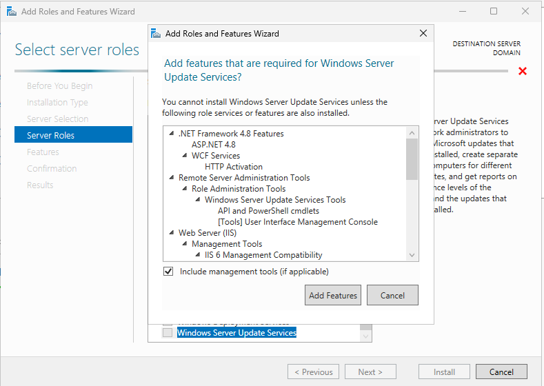  

**Teknik Detaylar:**  
- Server Core kurulumunda PowerShell veya sconfig kullanılır  
- GUI modunda Server Manager otomatik başlar  
- Rol bazlı kurulum için temel arayüz  

✅ WSUS kurulumuna başlamak için **"Add roles and features"** bağlantısına tıklayın.  

**PowerShell Alternatifi:**  
```powershell
# Server Manager'ı PowerShell'den başlatma
servermanager
```

---

### Adım 2: "Add Roles and Features Wizard" Başlatma  

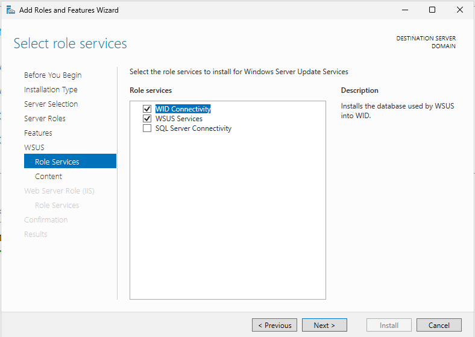  

**Kritik Ön Kontroller:**  
- ✅ Statik IP yapılandırması doğrulanmalı  
- ✅ DNS çözümlemesi test edilmeli  
- ✅ Güncel Windows Update'ler kontrol edilmeli  

**Teknik Doğrulama Komutları:**  
```powershell
# IP yapılandırmasını kontrol et
Get-NetIPConfiguration

# DNS çözümlemesini test et
Test-NetConnection -ComputerName "www.microsoft.com" -Port 80

# Windows Update durumunu kontrol et
Get-WindowsUpdateLog
```

💡 Bu sayfa yalnızca bilgilendiricidir. **Next** butonuna tıklayarak devam edin.  

---

### Adım 3: Kurulum Türü Seçimi  

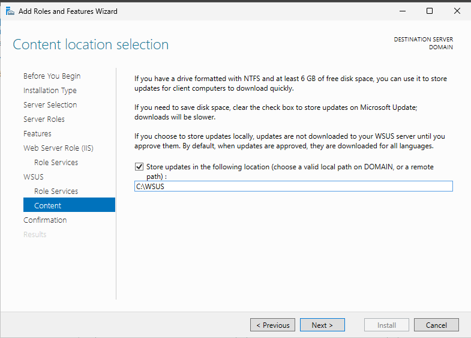  

**Kurulum Türleri Detayı:**  
- **Role-based or feature-based installation**: Lokal veya remote sunucuya rol ekleme  
- **Remote Desktop Services installation**: RDS farm dağıtımı için  

✅ **"Role-based or feature-based installation"** seçeneğini işaretleyin.  
**Next** butonuna tıklayın.  

**PowerShell ile Rol Ekleme:**  
```powershell
# WSUS rolünü PowerShell ile ekleme
Install-WindowsFeature -Name UpdateServices -IncludeManagementTools
```

---

### Adım 4: Hedef Sunucu Seçimi  

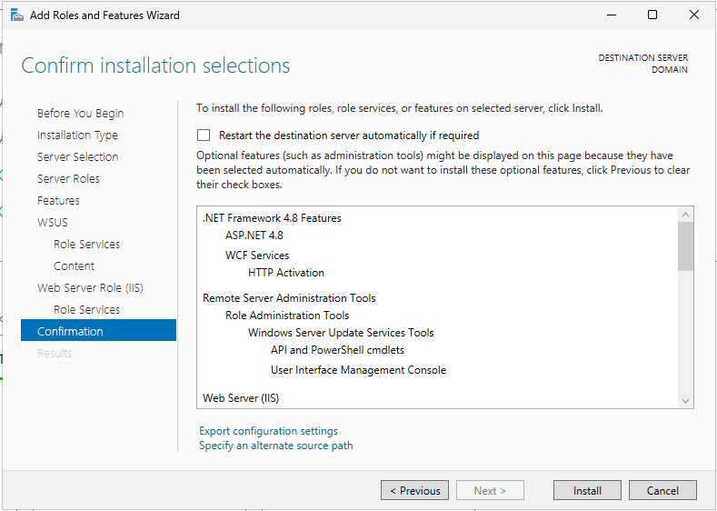  

**Sunucu Seçim Teknik Detayları:**  
- **Server Pool**: Mevcut yönetilen sunucular listesi  
- **Offline Sunucular**: Erişilemeyen sunucular gri görünür  
- **IPv6 Desteği**: Windows Server 2025 IPv6'yı tam destekler  

✅ Kurulum yapılacak sunucu zaten seçili gelir. Doğru sunucuyu seçtiğinizden emin olduktan sonra **Next** butonuna tıklayın.  

**Sunucu Bilgilerini Doğrulama:**  
```powershell
# Sunucu bilgilerini görüntüleme
Get-ComputerInfo | Select-Object WindowsProductName, WindowsVersion, CsDomain
```

---

### Adım 5: WSUS Rolü Seçimi  

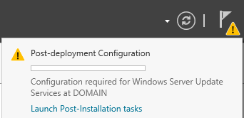  

**Yüklenen Bileşenler:**  
- **Windows Server Update Services**: Temel WSUS hizmetleri  
- **Windows Internal Database (WID)**: Veritabanı desteği (SQL Server alternatifi)  

**Teknik Özellikler:**  
- **WSUS Database**: Update verilerini depolar  
- **WSUS Administration Console**: Yönetim arayüzü  
- **IIS Web Server**: HTTP/HTTPS üzerinden update dağıtımı  

✅ **"Include management tools (if applicable)"** seçeneği otomatik işaretlenir.  
Açılan pencerede **Add Features** butonuna tıklayıp **Next** butonuna geçin.  

---

### Adım 6: WSUS Role Services Seçimi  

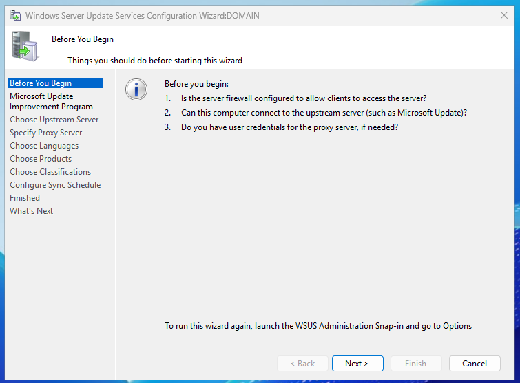  

**Seçilen Role Services:**  
- ✅ **WID Database**: Windows Internal Database (WID)  
- ✅ **WSUS Services**: Temel update hizmetleri  
- ✅ **Report Viewer**: Raporlama desteği  

**Alternatif Seçenekler:**  
- **SQL Server Database**: Dış SQL Server kullanımı  
- **Update Services API**: Programlama desteği  

**PowerShell ile Rol Seçimi:**  
```powershell
# WSUS Role Services kurulumu
Install-WindowsFeature -Name UpdateServices -IncludeManagementTools -Restart
```

✅ **Next** butonuna tıklayarak devam edin.  

---

### Adım 7: Content Location Seçimi  

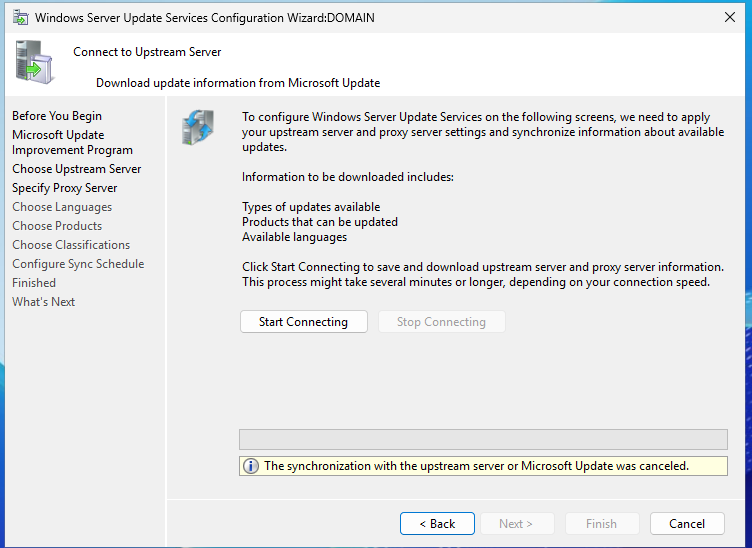  

**Content Location Ayarları:**  
- **Content folder location**: `C:\WSUS` (Önerilen)  
- **Storage type**: `NTFS` (Gerekli)  

**Teknik Öneriler:**  
- Update içeriği için **en az 100 GB** boş alan  
- **SSD disk** kullanımı önerilir (Performans artışı)  
- **Klasör izinleri**: `NT AUTHORITY\NETWORK SERVICE` (Full Control)  

**PowerShell ile Content Konumu:**  
```powershell
# WSUS content klasörü oluşturma
New-Item -Path "C:\WSUS" -ItemType Directory
# NTFS izinleri ayarlama
icacls "C:\WSUS" /grant "NETWORK SERVICE:(OI)(CI)(F)"
```

✅ **Next** butonuna tıklayarak devam edin.  

---

### Adım 8: Yükleme İşlemi ve Onay  

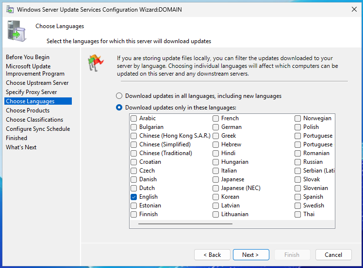  

**Kurulum Bileşenleri Listesi:**  
```
Windows Server Update Services
├── WSUS Services
├── WID Database
└── Report Viewer
```

**Kurulum Seçenekleri:**  
- ☐ **Restart the destination server automatically if required**  
- ☐ **Export configuration settings**  
- ☐ **Specify an alternate source path**  

✅ **Install** butonuna tıklayarak kurulumu başlatın.  

**Kurulum Doğrulama:**  
```powershell
# WSUS servis durumunu kontrol et
Get-Service -Name WsusService | Select-Object Name, Status, StartType
# IIS durumu kontrolü
Get-Service -Name W3SVC | Select-Object Name, Status, StartType
```

---

### Adım 9: Post-Installation Tasks Başlatma  

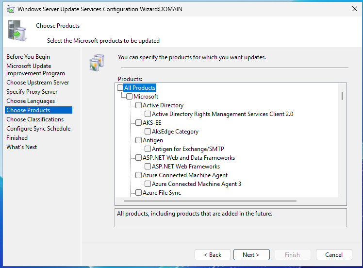  

**Post-Installation Steps:**  
1. **Launch Post-Installation Tasks** seçeneği  
2. **WSUS Configuration Wizard** başlatılır  
3. **Microsoft Update Connection** ayarları  

**Teknik Detaylar:**  
- **WSUS Configuration Wizard** otomatik olarak açılır  
- **Post-installation tasks** tamamlandığında **"Configuration succeeded"** mesajı  
- **Windows Server Update Services** rolü kurulmuş olur  

✅ **Next** butonuna tıklayarak devam edin.  

---

### Adım 10: WSUS Configuration Arayüzü  

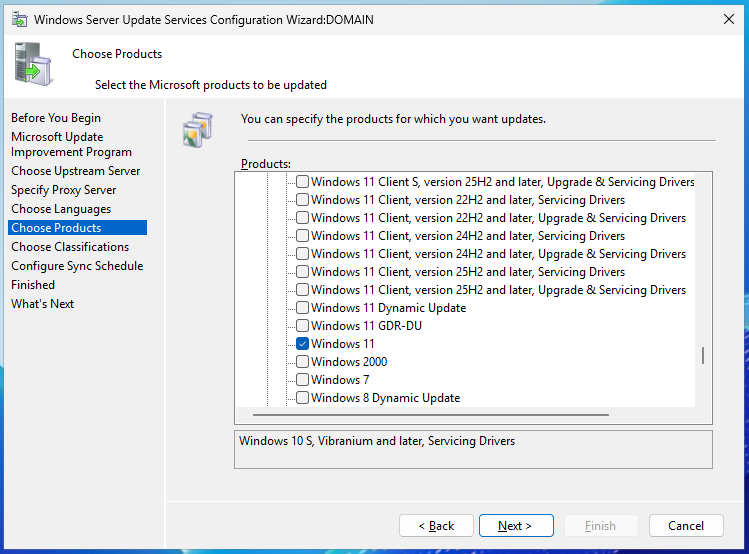  

**WSUS Configuration Ekranı:**  
- **Connection Type**: Microsoft Update veya Local WSUS  
- **Proxy Settings**: Kurum içi proxy desteği  
- **Database Settings**: WID veya SQL Server  

**PowerShell ile Temel Yapılandırma:**  
```powershell
# WSUS configuration ayarları
Set-WsusServerSynchronization -SyncFromMU $true -UpdateSource $true
```

✅ **Next** butonuna tıklayarak devam edin.  

---

### Adım 11: Before You Begin  

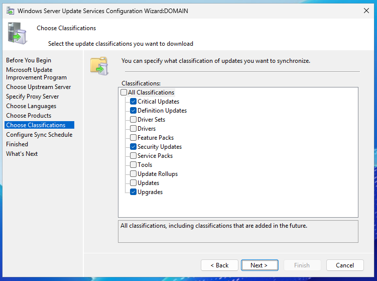  

**Ön Koşul Kontrolleri:**  
1. **Güvenlik Duvarı Ayarları:**  
   - WSUS sunucusuna erişim için 8530/8531 portları açılmalıdır
   - İstemcilerin WSUS sunucusuna erişimi sağlanmalıdır
   
2. **Microsoft Update ile Bağlantı:**  
   - Sunucunun internete erişimi olmalıdır
   - Microsoft Update sunucularına erişim sağlanmalıdır
   
3. **Proxy Ayarları:**  
   - Kurum içi proxy kullanılıyorsa doğru ayarlar yapılmalıdır
   - Proxy için kullanıcı kimlik bilgileri gerekebilir

**Teknik Doğrulama:**  
```powershell
# Güvenlik duvarı kuralları kontrolü
Get-NetFirewallRule -DisplayName "WSUS" -ErrorAction SilentlyContinue

# İnternet bağlantısı kontrolü
Test-NetConnection -ComputerName "www.update.microsoft.com" -Port 443
```

✅ **Next** butonuna tıklayarak devam edin.  

---

### Adım 12: Microsoft Connection ve Dil Seçimi  

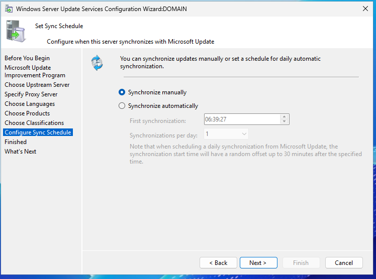  

**Microsoft Connection Ayarları:**  
- ✅ **Synchronize from Microsoft Update**  
- **Update Languages**: İngilizce/Türkçe (Önerilen)  

**Dil Seçimi:**  
- **English (United States)**  
- **Turkish (Turkey)**  
- **Other languages** (İhtiyaç halinde)  

**PowerShell ile Dil Ayarları:**  
```powershell
# WSUS dil ayarları
Set-WsusServerSynchronization -Language "tr-TR" -UpdateSource $true
```

✅ **Next** butonuna tıklayarak devam edin.  

---

### Adım 13: Update Kaynakları ve İşletim Sistemleri Seçimi  

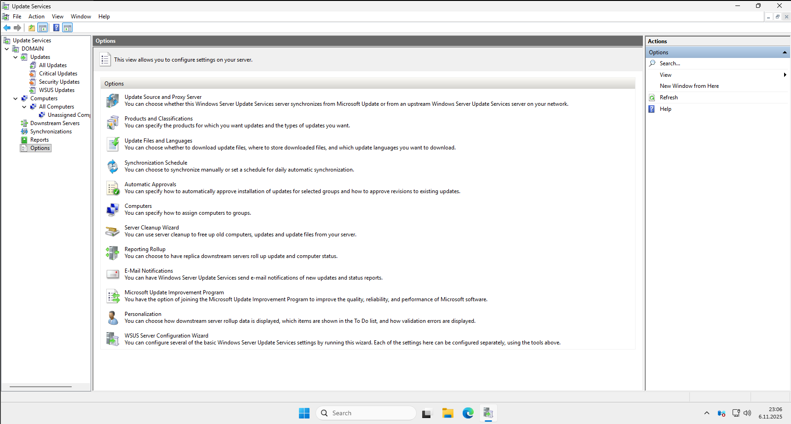  

**Update Kaynakları:**  
- ✅ **Windows 10/11**  
- ✅ **Windows Server 2025**  
- ✅ **Windows Server 2022**  
- ✅ **Office 365**  

**İşletim Sistemleri:**  
- **Windows 10/11**: 21H2, 22H2, 23H2  
- **Windows Server**: 2019, 2022, 2025  

**PowerShell ile Ürün Seçimi:**  
```powershell
# Windows 10/11 ürünlerini etkinleştirme
Get-WsusProduct | Where-Object {$_.ProductTitle -like "*Windows 10/11*"} | Set-WsusProduct -Enable
```

✅ **Next** butonuna tıklayarak devam edin.  

---

### Adım 14: Update Sınıflandırmaları ve Zamanlama  

  

**Update Sınıflandırmaları:**  
- ✅ **Critical Updates**  
- ✅ **Security Updates**  
- ✅ **Definition Updates**  
- ✅ **Feature Updates**  

**Zamanlama Ayarları:**  
- **Synchronization schedule**: Günlük 2:00 AM  
- **Manual synchronization**: İhtiyaç halinde elle tetikleme  

**PowerShell ile Zamanlama:**  
```powershell
# Günlük senkronizasyon ayarı
Set-WsusServerSynchronization -SyncFromMU $true -ScheduledSyncDay EveryDay -ScheduledSyncTime 02:00
```

✅ **Finish** butonuna tıklayarak kurulumu tamamlayın.  

---

### Adım 15: Configure Sync Schedule


**Senkronizasyon Zamanlaması:**  
- **Synchronize manually**: Elle tetiklenen güncelleme  
- **Synchronize automatically**: Otomatik senkronizasyon  
  - **First synchronization**: İlk senkronizasyon zamanı (Örnek: `06:39:27`)  
  - **Synchronizations per day**: Gündelik senkronizasyon sayısı (Örnek: `1`)  

**Teknik Detaylar:**  
- Otomatik senkronizasyon zamanı 30 dakika rastgele kaydırma içerir  
- Senkronizasyon sırasında ağ trafiği artar  
- En iyi uygulama: Gece saatlerinde senkronizasyon  

**PowerShell ile Senkronizasyon Ayarları:**  
```powershell
# Günlük otomatik senkronizasyon
Set-WsusServerSynchronization -SyncFromMU $true -ScheduledSyncDay EveryDay -ScheduledSyncTime 02:00 -SyncNow $false

# El ile senkronizasyon
Invoke-WsusServerSynchronization
```

✅ **Next** butonuna tıklayarak devam edin.  

---

### Adım 16: Choose Classifications


**Update Sınıflandırmaları:**  
- ✅ **Critical Updates**: Kritik güvenlik yamaları  
- ✅ **Definition Updates**: Tanım güncellemeleri (Antivirüs)  
- ✅ **Security Updates**: Güvenlik yamaları  
- ✅ **Upgrades**: Sürüm yükseltmeleri  

**Diğer Sınıflandırmalar:**  
- ❌ **Driver Sets**: Sürücü güncellemeleri  
- ❌ **Driver**: Bireysel sürücü güncellemeleri  
- ❌ **Feature Packs**: Özellik paketleri  
- ❌ **Service Packs**: Servis paketleri  
- ❌ **Tools**: Araç güncellemeleri  
- ❌ **Update Rollups**: Toplu güncellemeler  
- ❌ **Updates**: Genel güncellemeler  

**En İyi Uygulama:**  
- Üretim ortamında sadece **Critical Updates**, **Security Updates** ve **Definition Updates** seçilmesi önerilir  
- Test ortamında tüm güncellemeler indirilebilir  

**PowerShell ile Sınıflandırma Ayarları:**  
```powershell
# Critical Updates etkinleştirme
Get-WsusClassification | Where-Object {$_.ClassificationTitle -eq "Critical Updates"} | Set-WsusClassification -Enable

# Security Updates etkinleştirme
Get-WsusClassification | Where-Object {$_.ClassificationTitle -eq "Security Updates"} | Set-WsusClassification -Enable

# Definition Updates etkinleştirme
Get-WsusClassification | Where-Object {$_.ClassificationTitle -eq "Definition Updates"} | Set-WsusClassification -Enable
```

✅ **Next** butonuna tıklayarak devam edin.  

---

### Adım 17: Update Services Arayüzü ve Ekstra Özellikler


**WSUS Management Console:**  
- **Sol Paneldeki Bölümler:**  
  - **Update Services**: Temel yönetim arayüzü  
  - **All Updates**: Tüm güncellemelerin listesi  
  - **Critical Updates**: Kritik güncellemeler  
  - **Security Updates**: Güvenlik güncellemeleri  
  - **Computers**: Sunucuya bağlı istemciler  
  - **Downstream Servers**: Alt seviye WSUS sunucuları  
  - **Reports**: Raporlama seçenekleri  
  - **Options**: Genel yapılandırma ayarları  

**Options (Seçenekler) Bölümleri:**  
1. **Update Source and Proxy Server**:  
   - Microsoft Update veya üst seviye WSUS sunucu seçimi  
   - Proxy ayarları  

2. **Products and Classifications**:  
   - Güncellenecek ürünler ve sınıflandırmalar  

3. **Update Files and Languages**:  
   - İndirilecek diller ve dosya depolama konumu  

4. **Synchronization Schedule**:  
   - Senkronizasyon zamanlaması  

5. **Automatic Approvals**:  
   - Otomatik onay kuralları  

6. **Computers**:  
   - Bilgisayar grupları yönetimi  

7. **Server Cleanup Wizard**:  
   - Eski dosyaları temizleme aracı  

8. **Reporting Rollup**:  
   - Raporlama ayarları  

**PowerShell ile Temel Yapılandırma:**  
```powershell
# WSUS yönetim konsolunu açma
wsus.vbs
```

✅ Kurulum ve yapılandırma tamamlandı. WSUS sunucusu artık güncellemeleri yönetebilir durumdadır.  

---

## 🔧 Kurulum Sonrası Ekstra Özellikler  

### Update Yönetimi ve Onaylama  
- **Update onaylama**: Manuela veya otomatik  
- **Grup temelli dağıtım**: AD OU'ları ile hedefleme  
- **Paketleme ve yama yönetimi**  

**PowerShell ile Update Yönetimi:**  
```powershell
# Tüm update'leri onayla
Get-WsusUpdate -Approval Unapproved | Approve-WsusUpdate -Action Install -TargetGroupName "All Computers"
```

### Raporlama ve İzleme  
- **Günlük raporlar**: Update istatistikleri  
- **Hata analizi**: Başarısız update'ler  
- **İzleme panosu**: Gerçek zamanlı durum  

**PowerShell ile Raporlama:**  
```powershell
# Update istatistikleri
Get-WsusUpdateSummary | Format-Table Product, UpdateType, Approved, Installed
```

### Otomatik Onay Kuralları  
```powershell
# Critical Updates için otomatik onay
$rule = New-WsusApprovalRule -Name "Critical Updates Auto-Approval" -Action Install -Product "Windows 10" -UpdateClassifications "Critical Updates"
Set-WsusApprovalRule -Rule $rule
```

---

## 🛠️ Sık Karşılaşılan Sorunlar ve Çözümler  

### 1. Senkronizasyon Sorunları  
**Belirtiler:**  
- "The synchronization with the upstream server or Microsoft Update was canceled."  
- Senkronizasyon tamamlanamıyor  

**Çözüm:**  
```powershell
# WSUS veritabanı onarımı
wsusutil.exe reset

# Senkronizasyon durumunu kontrol et
Get-WsusServer | Get-WsusUpdateServer | Get-WsusSynchronizationStatus

# Senkronizasyonu manuel başlat
Invoke-WsusServerSynchronization
```

### 2. Update İndirme Sorunları  
**Belirtiler:**  
- Update'ler indirilemiyor  
- "Failed to download update" hataları  

**Çözüm:**  
```powershell
# Update içeriğini temizle ve yeniden indir
Get-WsusServer | Get-WsusUpdateServer | Sync-WsusServer

# Update içeriği klasörünü kontrol et
Get-WSUSServer | Get-WsusUpdateServer | Get-WsusUpdate | Where-Object {$_.IsDownloaded -eq $false} | ForEach-Object { $_.Decline() }
```

### 3. WSUS Veritabanı Sorunları  
**Belirtiler:**  
- Sunucu yavaş çalışıyor  
- Update'ler gösterilmiyor  

**Çözüm:**  
```powershell
# WSUS veritabanı temizleme
wsusutil.exe deleteunneededrevisions

# Veritabanı sıkıştırma
$wsus = Get-WsusServer
$database = $wsus.GetDatabase()
$database.PerformMaintenance([Microsoft.UpdateServices.Administration.MaintenanceOperation]::CleanDatabase)
```

---

## 📜 Doküman Bilgileri  

| Özellik | Değer |  
|---------|-------|  
| **Yazar** | Serif SELEN |  
| **Tarih** | 5 Kasım 2025 |  
| **Versiyon** | 1.0 |  
| **Platform** | VMware Workstation Pro 17 |  
| **İşletim Sistemi** | Windows Server 2025 Standard Evaluation |  
| **WSUS Content** | `C:\WSUS` |  
| **Lisans** | Evaluation (180 gün) |  

> ⚠️ Bu doküman **eğitim ve test ortamları** içindir. Üretimde lisanslı yazılım ve güvenlik önlemleri kullanılmalıdır.  

> 📧 **Destek İçin:** mserifselen@gmail.com  
> 🔗 **GitHub Repository:** [https://github.com/serifselen/Windows-Server-2025-Kurulum](https://github.com/serifselen/Windows-Server-2025-Kurulum)